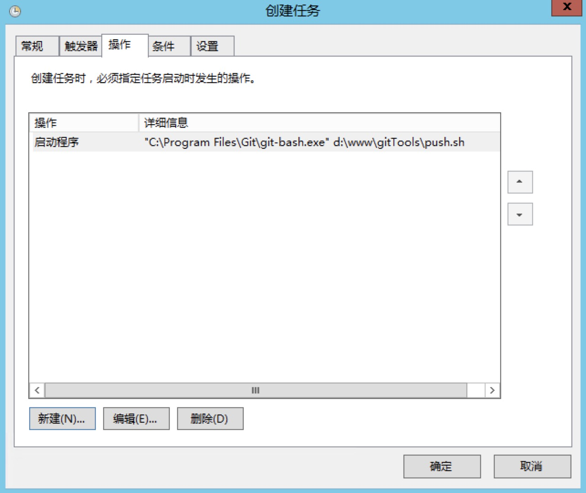
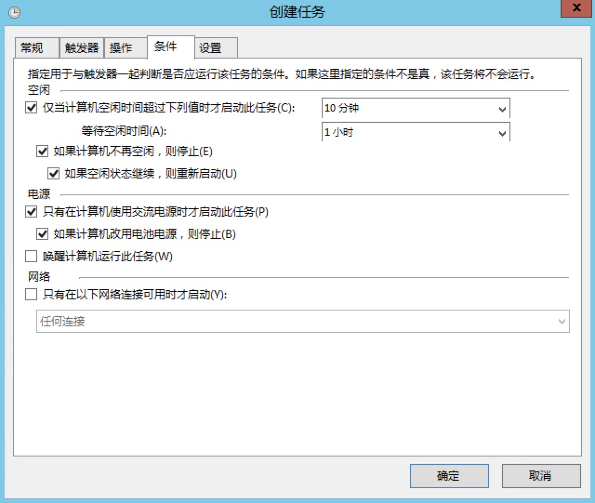

# gitTools

这是git常用的脚本

## 目录

```
├─bin                  执行脚本
    ├─gitAutoPush      git自动提交
    ├─gitSyncServer    git同步服务端
├─help                 帮助文档 
├─logs                 目志
```


## git自动批量提交

每个程序员都不可能开发一个项目,每天下班可能忘记提交或者意外导致丢失代码

注意: 意外这个词可能几年难出现一次,有时突然断电等特别原因

为了能够让代码丢失率更低,使用git自动批量提交,也许能帮助到您!

> 注意: 本脚本只适用于个人多项目,多人协作开发请手工提交

#### 下载/克隆到你的本地
```
$ git clone git@github.com:aa24615/gitTools.git

```
将脚本放置到任意目录,例如 /www/gitTools/

修改 push.sh 修改您的日志保存路径

### linux/mac平台使用方法

> 请规范放置你的网站项目

/www 作为根目录 多个站点请放在 www/ 下

例如
```
/www/web1/
/www/web2/

```

#### 添加到crontab
```
$ crontab -e

0 8 * * * sh /www/gitTools/push.sh #每天8点提交一次
0 */1 * * * sh /www/gitTools/push.sh #每隔1小时提交一次
#以上方案仅供参考,请根据自已的需要定制 

```

### win平台使用方法

#### 下载git工具

下载地址: [https://git-scm.com](https://git-scm.com)

#### 修改配置

将你的网站放在 D:\www\ 或者 C盘

然后修改 push.sh 网站根目录与日志存放的路径

如果你提放在D盘 则是 /d/www/

#### 手动测试

找到你的git安装位置,一般默认安装 C:\Program Files\Git\

按住S+右键 输入命令 "C:\Program Files\Git\git-bash.exe"  你的push.sh路径

"C:\Program Files\Git\git-bash.exe"  D:\www\gitTools\push.sh

> 注意 第一个路径需要加引号,因为Program Files目录中有空格

测试成功即可

#### 添加定时器

开始->控制面板->管理工具->任务计划程序

创建任务



添加操作,选择你的git安装位置,选择git-bash.exe

参数为push.sh的路径


设定你想要执行的条件




## GIT同步服务器(本地提交,服务器拉取)


这是一个本地仓库与服务器同步推拉的脚本

随着git的便捷,我们不再使用ftp作为上传工具

很多开发者都喜欢使用git推送到github或gitee上面,然后从服务器执行pull操作

然而用久了还是有点小麻烦,当你push之后你又去开一个窗口登录ssh进去pull操作

那是不是可以做到一推上去,服务器就自动pull呢 可以的!


### 使用方法

1.将 `gitSyncServer.sh` 用文本打开,修改对应参数

```
host="127.0.0.1" #服务器ip
user="root" #用户名
password="root" #密码
port="22" #端口
wwwroot="/www/test" #服务器上的目录

```

2.将这个脚本放在网站(仓库根目录下)

3.执行 `sh gitSyncServer.sh` 即可

4.如果有代码冲突等,请手动解决


### License

gitTools is licensed under the license of MIT. See the [LICENSE](LICENSE) for more details.


